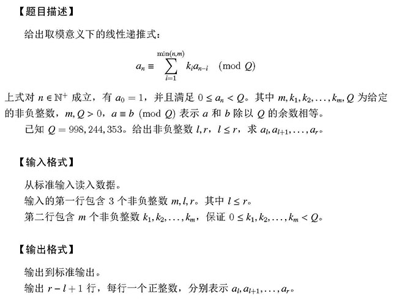
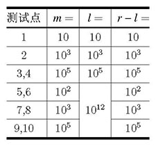

CCF CSP 201809-5 线性递推式
============================

# 问题描述 - The Problem
  
  

# 关于代码 - About the Solution
代码位于[csp5-final.cpp](csp5-final.cpp)。  
The solution is in file [csp5-final.cpp](csp5-final.cpp).  

使用一般的求解常系数线性递推式的方法进行求解，使用AVX2对NTT进行了5.5倍左右的优化，本机运行时间从3.3s优化至0.6s。  
Tt uses AVX2 to speed up NTT by about 5.5 times (running time is reduced from 3.3s to 0.6s).  

该代码在[GPLv3](LICENSE.txt)下发布。  
This solution is distributed under [GPLv3](LICENSE.txt).  
